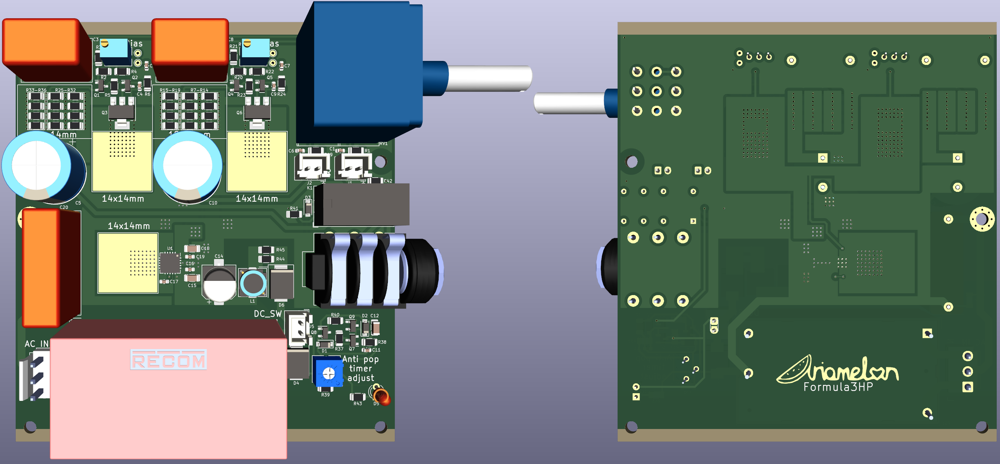
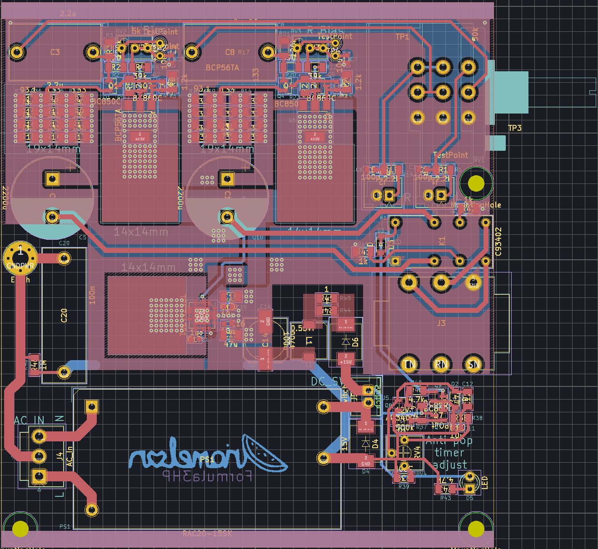
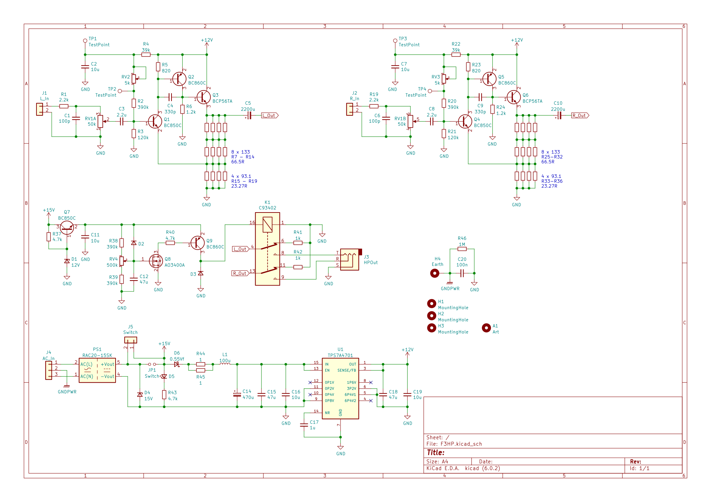

# F3HP
A compact, class A amplifier with a schematic from [this](https://www.diyaudio.com/community/threads/3-transistor-hp-amplifier-with-low-dist.359267) thread.
This design uses mostly SMT components with some THT. It is designed to fit in [this](https://item.taobao.com/item.htm?id=543297256145) case. The 3D model and dimensions are included with the design files.

